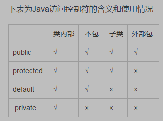

# 1.Java的基础（一）：J2SE  

## 1.java环境  

### 1.环境的配置

所需的工具清单：Eclipse，JDK   
环境的配置过程，直接百度关键字“配置JAVA的环境变量”，这里就不再做赘述。  

### 2.环境的介绍

JDK：Java 语言的软件开发工具包，包含JRE（Java运行环境）  

---

## 2.第一个简单程序  

**输入一个成绩，判断输出是“及格”，还是“不及格”。（ps:用到Scanner）**
```java
import java.util.Scanner;
public class Main {
	public static void main(String[] args) {
		System.out.println("请输入成绩：");
		Scanner input=new Scanner(System.in);
		int num=input.nextInt();  //获取成绩
		if(num>=60){
			System.out.println("成绩及格");
		}else{
			System.out.println("不及格");
		}
	}
}
```

---

## 3.循环语句  
**循环打印姓名"Mike","Jenny","Johnson","Amy","Mary","Cathrine","Armstrong","Dony"并且三个一换行**
```java
public static void main(String[] args) {
//	1.将姓名存入数组
	String[] arr={"Mike","Jenny","Johnson","Amy","Mary","Cathrine","Armstrong","Dony"};
	for (int i = 0; i < arr.length; i++) {
		System.out.print(arr[i]+"\t\t");
//		2.判断一旦3的倍数，添加换行
		if((i+1)%3==0){
			System.out.println();
		}
	}
}
```

---

## 4.基本元素
### 1.基本数据类型  
一共有4大类（8种）基本的数据类型  
1. 整型:byte(8个二进制),short（2个字节）,int（4个字节）,long（8个字节）  
2. 浮点:float,double  
3. 字符:char  
4. 布尔:boolean  

### 2.名词解释  
1. 类：具有相同或相似的事物统称（抽象的概念）  
2. 对象：类的某一个特例，叫做对象（活生生的个体）  
3. 成员变量：类的属性，类所具有的特征  
4. 成员函数：类的方法，类能实施的行为  
**定义一个类Person，其属性有：name，age，其方法有：eat()，sing()。实例化类，调用方法，打印“XX岁的XX在唱歌/吃饭”**
```java
public class Main {
public static void main(String[] args) {
	Person person=new Person();
	person.age=5;
	person.name="小明";
	person.eat();
	System.out.println("-----------");
	person.sing();
}
}
//1. 定义类，声明属性，方法
class Person{
	int age;
	String name;
	void eat(){
		System.out.println(age+"岁的"+name+"正在吃饭");
	}
	void sing(){
		System.out.println(age+"岁的"+name+"正在唱歌");
	}
}
```
*多态：父类的引用可以指向子类的对象：``Animal a=new Dog();``，当调用a对象的方法：如果子类用重写方法，则执行子类的方法，如果子类没有重写方法，则执行父类的方法。*

### 3.修饰符   
  
当修饰符为private的时候，要在外部访问，需要设置setter&getter方法  
*包package：用于对类（或其他类型）进行分类组织的机制*  
**定义一个类Person，其_私有_属性有：name，age，其_公开_方法有：eat()，sing()。实例化类，调用方法，打印“XX岁的XX在唱歌/吃饭”**  
```java
public class Main {
public static void main(String[] args) {
	Person person=new Person();
//	person.age=11111;    没办法赋值
	person.setAge(11);   //使用setter方法赋值
	person.setName("小白");
	person.eat();
	person.sing();
}
}

public class Person {
	private String name;
	private int age;
	public String getName() {
		return name;
	}
	public void setName(String name) {
		this.name = name;
	}
	public int getAge() {
		return age;
	}
	public void setAge(int age) {
		this.age = age;
	}
	public void eat(){
		System.out.println(age+"岁的"+name+"正在吃饭");
	}
	public void sing(){
		System.out.println(age+"岁的"+name+"正在唱歌");
	}
}
```

### 4.重载  
重载overloading：方法名相同，参数列表不同  
重写overridding：子类重写并覆盖父类的方法  

### 5.继承  
一个子类只能extends一个父类（也叫：超类，基类）  
所有的类都默认继承于java.lang.Object（就算Object也在基本包lang中）  
**定义一个类Person，其属性有：name，age，其方法有：show()，调用打印“XX岁XX人”。定义Student类继承Person，其属性追加score，其重写方法show(),调用打印“XX岁XX学生分数是XX”**
```java
public class Person {
	int age;
	String name;
	void show(){
		System.out.println(age+"岁"+name+"人");		
	}
}

public class Student extends Person{  //Student继承于Person
	int score;
	void show(){   //重写方法
		System.out.println(age+"岁"+name+"学生分数"+score);
	}
}

public class Main {
	public static void main(String[] args) {
		Person p=new Person();
		p.age=5;
		p.name="小黑";
		p.show();
		
		Student s=new Student();
		s.age=6;
		s.name="小黄";
		s.score=100;
		s.show();
	}
}

```

### 6.构造函数  
构造函数用来初始化对象，在创建对象的时候会被调用  
默认构造函数没有参数，不编写的时候系统会自动生成，自己编写则不会自动生成  
特点：1.名字和类的名字相同  2.没有返回值，但是不加void  3.构造函数可以有多个，参数不能相同  
**使用构造函数初始化Person类的姓名和年龄，调用show方法打印“XX岁XX人”，编写重载构造函数，传入姓名和年龄再打印show方法**  
```java
public class Person {
	int age;
	String name;
	//重写默认构造函数
	public Person() {
		this.age=3;
		this.name="初始化";
	}
	//重载构造函数
	public Person(int age,String name){
		this.age=age;
		this.name=name;
	}
	void show(){
		System.out.println(age+"岁的"+name+"人");
	}
}

public class Main {
public static void main(String[] args) {
	Person p=new Person();
	p.show();
	System.out.println("-------------");
	Person p2=new Person(8,"小灰");
	p2.show();
}
}
```

### 7.传值与传址  
传值：简单的类型 byte,short,int,long / float,double / boolean / char  
传址：引用的类型 String,对象  

### 8.接口  
接口类似于父类，区别就是接口只能为抽象方法  
**定义教师与学生接口，用助教类实现它们，把多态体现出来**  
```java
public interface Teacher {
public void teach();
}

public interface Student {
public void study();
}

public class Assist implements Teacher,Student{
	public void study() {
		System.out.println("正在学习");
	}
	public void teach() {
		System.out.println("正在教书");
	}
}

public class Main {
public static void main(String[] args) {
	//助教状态
	Assist a=new Assist();
	a.study();
	a.teach();
	System.out.println("------------");
	//教师状态
	Teacher t=new Assist();
	t.teach();   //教师状态没有study()方法
	//转化为学生状态
	Student s=(Student)t;    //强制转化为学生，就有study()方法
	s.study();
}
}
```  
*如果没有代码提示，开启提示：Window -> preferences -> Java -> Editor -> Content assist -> Auto-Activation.abcdefghijklmnopqrstuvwxyz*  

### 9.抽象类&内部类  
**抽象类**：包含抽象方法的类（接口是纯抽象类）  
编写抽象方法需要在方法和类上面添加abstract  
抽象类不能实例化，需要创建一个类去继承抽象类（继承之后没实现，也叫抽象类），实现其方法之后才可以实例化  

**内部类**：类中又包含类  
（ 内部类的深析：http://www.360doc.com/showWeb/0/0/412191736.aspx ）  

