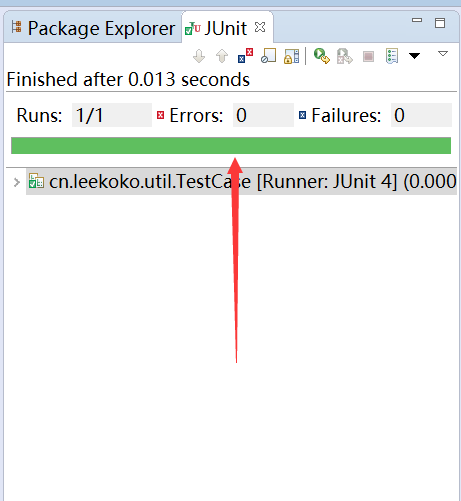
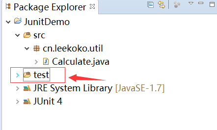

# Junit      

### 1.Junit的使用  

1. Junit使用首先要导入Junit的jar包

右键项目--Build Path--Add Libraries--Junit--选择Junit 4点击确定。  

2. 新建测试类    

右键项目--新建Junit Test Case：创建测试方法的模板    

3. 根据模板编写测试方式  

```java
	@Test
	public void test() {
		assertEquals(6, new Calculate().add(2, 4));
	}
```

使用assertEquals，表示对两个的结果进行对比  

右键 run as--Junit Test进行运行，如果Junit窗口出现绿条说明测试通过，红色则表示测试失败。   

    

（Failures：表示程序输出结果与预期的不一样。Error：表示代码本身的错误或者bug）  

### 2.新建测试方法的规范  

一般我们测试类是放在一个新的文件夹里面，一旦项目完成，直接删除并且不会影响项目本身。  

1. 所以现在项目下新建一个test文件夹   

  

2. 然后右键项目--新建Junit Test Case，修改类的目录位置为test，点击next，选择要测试的方法名打勾，点击finish就能自动生成测试方法。  

  

3. 这里还有一些命名上的规范  

测试对象：类名Calculate    方法名add

测试类：类名CalculateTest  方法名testAdd   

类名后面添加Test，方法名前面添加test   

### 3.注解的介绍  

#### 1.@BeforeClass  

所以方法调用前执行。是静态的，适合加载配置文件  

#### 2.@AfterClass  

所有方法执行后执行，用来资源清理，如关闭数据库连接  

#### 3.@Before&@After   

每个测试方法前后执行   

#### 4.@Test  

1. expected属性  

当@Test下的方法有异常，我们不想让其抛出，需要用``(expected=ArithmeticException.class)``来捕获ArithmeticException异常    

2. timeout属性  

当程序死循环，为了保证系统不奔溃，定时关闭程序，也可以作为性能测试  

``(timeout=2000)``  

#### 5.@Ignore  

测试的时候忽略@Ignore("注释:为什么没有执行")的方法  

#### 6.@RunWith  

更改测试运行器，一般使用默认的就可以完成   

 


