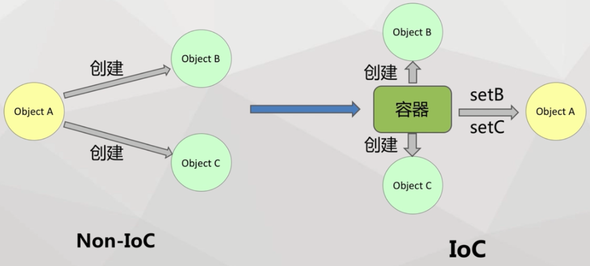
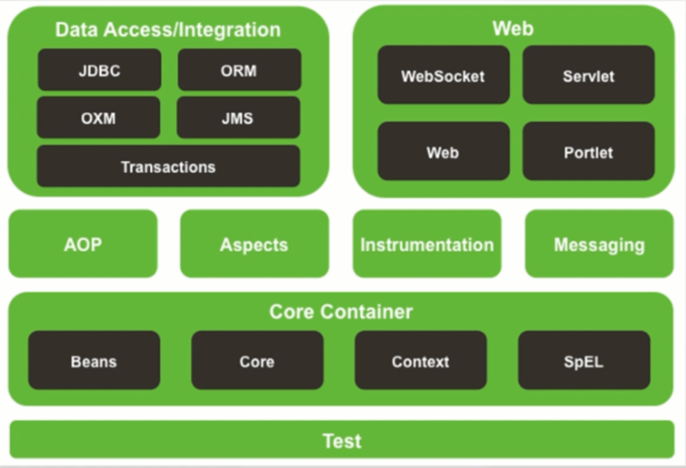

# IOC控制反转   

## 1.IOC的介绍   

1. DI是IOC的另外一种表示方式，其中：

- DI是目标：依赖注入   
- IOC是方式：控制反转    

所谓的去控制反转就是将对象的使用者从自身交给了Ioc容器    

_我们是饺子厂商，主要卖有两种饺子。一种是包装的，包什么馅料由我们决定，这就像我们普通的对象使用方式。但是由于有的买家喜欢不同口味的馅料，为了让买家吃得更加灵活，并且降低生产成本，所以就只生产饺子皮，让买家自己去包饺子。这就像将肉馅的控制权限交给了用户，是一种控制反转。_   

2. IOC和非IOC的对比：

  

## 2.AOP的介绍  

将业务逻辑和非业务逻辑分开来写，但是运行的时候要一起运行。   

Spring模块（feiman）  

    

- Core Container:创建对象，组装依赖，生命周期的管理，上下文环境  
- Aop，Aspects等整行：Aop实现，AspectJ支持   
- Data Access：JDBC的支持（连接管理，异常处理），事务管理，ORM整合      
- Web：Servlet Based MVC ，Web工具支持，模块支持

## 3.Spring的使用   

### 1.新建maven工程   

- 选择简单工程，使用war包/使用jar    

> jar包相当于一个个的类集合成一个包，当你使用某些功能时就需要这些jar包的支持，需要导入jar包。
> war包是web工程中对web应用的一个打包，目的是节省资源，提供效率，把war包方法到服务器指定文件夹中，war包会自动生成一个web应用，十分方便。

- 解决新建报错：缺少web.xml，右键项目选择Generate Deployment Descriptor Stub   
- tomcat运行注意修改其配置   

### 2.添加pom依赖   

```xml
<project xmlns="http://maven.apache.org/POM/4.0.0" xmlns:xsi="http://www.w3.org/2001/XMLSchema-instance" xsi:schemaLocation="http://maven.apache.org/POM/4.0.0 http://maven.apache.org/xsd/maven-4.0.0.xsd">
  <modelVersion>4.0.0</modelVersion>
  <groupId>cn.leekoko.course</groupId>
  <artifactId>spring-container</artifactId>
  <version>0.0.1-SNAPSHOT</version>
  
  <dependencies>  
	<dependency>
	    <groupId>org.springframework</groupId>
	    <artifactId>spring-context</artifactId>
	    <version>4.2.1.RELEASE</version>
	</dependency>
	
  </dependencies>
      
</project>
```

_引入spring相关jar包的过程_   

### 3.在sources中新建application-context.xml   

```xml
<?xml version="1.0" encoding="UTF-8"?>  
<beans xmlns="http://www.springframework.org/schema/beans" 
	xmlns:context="http://www.springframework.org/schema/context" 
	xmlns:xsi="http://www.w3.org/2001/XMLSchema-instance" 
    xmlns:p="http://www.springframework.org/schema/p" 
    xsi:schemaLocation="  
    http://www.springframework.org/schema/context  
    http://www.springframework.org/schema/context/spring-context.xsd  
    http://www.springframework.org/schema/beans  
    http://www.springframework.org/schema/beans/spring-beans.xsd">  
    
    
</beans>    
```

_为了xml文件的规范合法，需要引入命名空间和标签规范_  	

### 4.新建bean类   

```java
public class ScrewDriver {
	public void use(){
		System.out.println("Use screwdriver");
	}
}
```

### 5.在application-context.xml中添加bean  

```xml
    <!-- 定义bean -->
    <bean id="screwDriver" class="cn.leekoko.course.ScrewDriver"></bean>
```

### 6.测试代码   

```java
public class TestContainer {
	public static void main(String[] args) {
		//获取ioc容器
		ApplicationContext context=
				new ClassPathXmlApplicationContext("application-context.xml");
		ScrewDriver screwDriver=context.getBean("screwDriver",ScrewDriver.class);
		screwDriver.use();
	}

}
```

通过读取application-context文件获取ioc容器，用ioc容器获取bean类，执行bean类的方法。   

### 7.作用域   

- singleton：bean的配置默认就是singleton，也可以添加scope="singleton"设立。 

只有一个对象：在声明一次对象之后，就算多次声明，也不会改变其属性值。    

- prototype：添加scope="prototype"

每次获取都是一个新的对象，状态不共享      


_作用域就是对象的有效范围：prototype只能用一个，singleton多个都是同一个，_


在web.xml中启动配置文件的加载，web-app中添加：

```xml  
	<context-param>
		<param-name>contextConfigLocation</param-name>
		<param-value> 
		classpath:application-context.xml </param-value>
	</context-param>

	<listener>
		<listener-class>org.springframework.web.context.ContextLoaderListener</listener-class>
	</listener>

	<servlet>
		<servlet-name>example</servlet-name>
		<servlet-class>org.springframework.web.servlet.DispatcherServlet</servlet-class>
	</servlet>
	<servlet-mapping>
		<servlet-name>example</servlet-name>
		<url-pattern>/api/*</url-pattern>
	</servlet-mapping>
```

指定application-context.xml的路径，


DispatcherServlet需要有对应的配置文件example-servlet.xml  

设置扫描类

```xml
<?xml version="1.0" encoding="UTF-8"?>
<beans xmlns="http://www.springframework.org/schema/beans"
    xmlns:context="http://www.springframework.org/schema/context"
    xmlns:mvc="http://www.springframework.org/schema/mvc"  
    xmlns:xsi="http://www.w3.org/2001/XMLSchema-instance" 
    xsi:schemaLocation="http://www.springframework.org/schema/beans
	http://www.springframework.org/schema/beans/spring-beans.xsd
	http://www.springframework.org/schema/context
	http://www.springframework.org/schema/context/spring-context.xsd
	http://www.springframework.org/schema/mvc  
    http://www.springframework.org/schema/mvc/spring-mvc-3.0.xsd">

	<context:component-scan base-package="cn.leekoko.controller.HelloController"></context:component-scan>
</beans> 
```


### 3.新建Controller   

访问该路径输出文字：

```java
@Controller
@RequestMapping(value="/hello")
public class HelloController {
	@RequestMapping(value="/spring")
	public void spring(HttpServletResponse response) throws IOException{
		response.getWriter().write("Hello,Spring,hehe!!");
	}
	
}
```

_指定访问的路径_  


ApplicationContext=ioc容器  


