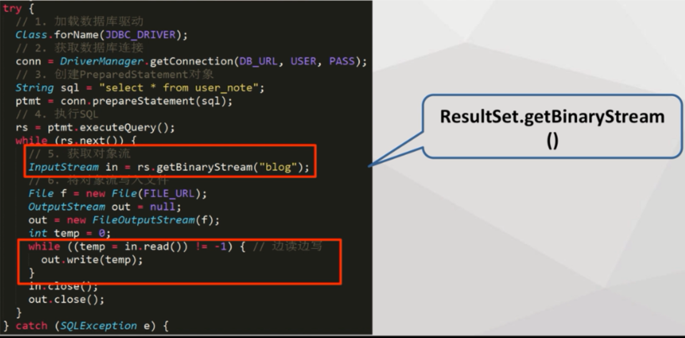

# JDBC的使用   

## 1.API的java类  

_这是一个搬砖工的故事，它在数据库与程序之间搬砖遇到了什么问题呢。_

1. Driver接口：通过操作Driver接口可对驱动程序操作  

   Driver接口就是大神在开发数据库驱动程序的时候实现了的接口，普通程序员只要找到对应Driver接口进行装载就可以使用这个驱动程序，例如mysql的jdbc驱动程序，其装载代码为`` class.forName("com.mysql.jdbc.Driver")``,引号里面的就是Driver接口    

2. DriverManager接口：Driver的管理类，用Class.forName注册驱动程序，通过getConnection（三个参数dbUrl，用户名，密码）建立物理链接。  

   DriverManager叫做Driver的管理类，我们通过这个管理类来使用Driver接口的功能，像getConnection就是用来建立驱动和程序“交流桥梁”的方法。

- dbUrl的组成：jdbc(协议):mysql(子协议)://10.164.172:3306/cloud_study(子名称)


（常见jdbc URL的格式）  

- Connection物理链接作用  

3. 创建Statement对象

Statement是sql容器，可以进行sql语句操作：``ResultSet rs=stmt.sescuteQuery("select userName from user");``   

_我是一个搬砖工，我们假设Connection是一座信息交流桥梁，而Statement就像是桥梁上的手扶小拉车，当我们从自身程序通过桥梁走向数据库的时候，拉车上面装的就是一条留言纸（sql语句），到达数据库之后，数据库的工人就会根据留言纸往车上装货物。当然货物是包装成一大件的（ResultSet），里面是整整齐齐的一个个板砖(每个元素)_    

ResultSet对象是sql查询的结果，ResultSet的方法有：下一个，上一个，首个，尾个，指定个。  获取对象的方法：getString(列名),getInt(列名),getObject(列名)   

_通过不同的方法，就可以从大件货物中取出自己所要的那一部分信息_  

## 2.jdbc的构建   

1. 构建的大概步骤  

  

2. 代码示意  

```java
public class HelloJdbc {
	static final String DB_URL="jdbc:mysql://localhost:3306/test";
	static final String USER="root";
	static final String PASSWORD="123456";
	
	private static void helloword() throws ClassNotFoundException {
		Connection conn=null;
		Statement stmt=null;
		ResultSet rs=null;
		
		//1.装载驱动程序
		Class.forName("com.mysql.jdbc.Driver");
		try {
			//2.建立数据连接
			conn=DriverManager.getConnection(DB_URL, USER, PASSWORD);
			//3.执行sql语句
			stmt=conn.createStatement();
			rs=stmt.executeQuery("select userName from user");
			//4.获取执行结构
			while(rs.next()){
				System.out.println("hello"+rs.getString("userName"));
			}
		} catch (SQLException e) {
			//异常处理
			e.printStackTrace();
		}finally {
			//5.清理环境
			try {
				if(conn!=null){
					conn.close();
				}
				if(stmt!=null){
					stmt.close();
				}
				if(rs!=null){
					rs.close();
				}
			} catch (SQLException e) {
					//ignore
			}
		}
	}
}
```

_搬砖其实也有一趟规范流程的：首先将所需材料放进来（驱动程序加载），然后使用材料建立数据库和自身程序的桥梁（Connection），这里就需要用到桥梁的路径（url，告诉指向哪里的，什么数据库，什么表），账号和密码。建立好连接桥梁之后，通过小扶手拉车（Statement）运送sql语句到数据库，数据库再返回一个包装好的大件回来（ResultSet），我们通过方法就可以取出想要的砖块（rs.getString("userName")）。这一切都执行完之后还没结束，因为桥梁，拉车，大件物品都还散落满地，这将大大占用了空间（系统资源），所以通过.close()方法将其回收起来。至于为什么要判断！=null呢？就是为了防止像桥梁铺设失败，小拉车半路就挂了等这些意外导致这东西本身就不存在。那么强行回收就会使得系统出错，所以要做出判断：你有，并且用完了，那就收起来吧~_    

## 3.查询大量sql语句的优化   

当一次读出较多的数据（千万条），使用普通Statement读取，就会发生内存溢出异常。

- 所以要每次读一部分，多次进行载入来避免内存溢出，所以就用到**游标**。  

使用游标的方式：在DBURL后面添加**?useCursorFetch=true**：``DB_URL="jdbc:mysql://localhost:3306/test?useCursorFetch=true";  ``  （开启游标）  

- 使用PerparedStatement接口，PerparedStatement接口相比Statement的好处？

PerpareStatement继承于Statement，使用 **PreparedStatement** 最重要的一点好处是它拥有更佳的性能优势，SQL语句会预编译在数据库系统中。执行计划同样会被缓存起来，它允许数据库做参数化查询。使用预处理语句比普通的查询更快，因为它做的工作更少（数据库对SQL语句的分析，编译，优化已经在第一次查询前完成了）。为了减少数据库的负载，生产环境中的JDBC代码你应该总是使用**PreparedStatement** 。值得注意的一点是：为了获得性能上的优势，应该使用参数化sql查询而不是字符串追加的方式。

PerpareStatement的SetFetchSize()接口可以实现游标的功能  

字符串追加：

``PreparedStatement prestmt = conn.prepareStatement("select banks from loan where loan_type="+ loanType);``    

参数化查询：

```
PreparedStatement prestmt = conn.prepareStatement("select banks from loan where loan_type=?");  
prestmt.setString(1,"类型内容");
```

- 游标的使用方式：  

```java
	static String DB_URL="jdbc:mysql://localhost:3306/test";
	static final String USER="root";
	static final String PASSWORD="123456";
	
	private static void helloword() throws ClassNotFoundException {
		Connection conn=null;
		PreparedStatement ptmt=null;
		ResultSet rs=null;
		
		//装载驱动程序
		Class.forName("com.mysql.jdbc.Driver");
		try {
			DB_URL=DB_URL+"?useCursorFetch=true";   //1.开启游标
			//建立数据连接
			conn=DriverManager.getConnection(DB_URL, USER, PASSWORD);
			ptmt=conn.prepareStatement("select userName from user");//2.获取prepareStatement
			ptmt.setFetchSize(1);    //3.设置每次读取一条
			rs=ptmt.executeQuery();    //4.执行语句
			//获取执行结构
			while(rs.next()){
				System.out.println("hello"+rs.getString("userName"));
			}
		} catch (SQLException e) {
			//异常处理
			e.printStackTrace();
		}finally {
			//清理环境
			try {
				if(conn!=null){
					conn.close();
				}
				if(ptmt!=null){
					ptmt.close();
				}
				if(rs!=null){
					rs.close();
				}
			} catch (SQLException e) {
					//ignore
			}
		}
	}
```

还是从数据库读取userName，但是这里使用的是游标的方式，每次读取一条。区别主要有四部分：

1. 开启游标
2. 获取prepareStatement
3. 设置每次读取一条
4. 执行语句

_然而有一天，当我们拉着手扶车去数据库搬砖的时候，突然收到了一个10吨的特大件，那么如果还是跟往常一样一次就拉回来，车直接压爆(内存溢出)。所以呢，就在拉货的时候告诉数据库，一次只要给我10块砖就够了，剩下的下次再来拿。(这种分次的策略就需要到prepareStatement的setFetchSize接口)_  

## 4.大字段内容优化  

除了多条数据可能产生内存溢出，一条记录可能也会产生内存溢出。

- 使用**流方式**以二进制方式按照区间进行划分，每次只读取一部分内容。（跟游标相似）    

代码示例：

  

_流方式跟游标原理相似，区别就是这是一块10吨重的大砖，一块即可压垮小车。但是计算机世界就是神奇，大砖也可以按照规则切割成一块块小砖(二进制区间)运输，然后再组合起来_    

## 5.大量数据插入优化  

用普通的插入方式插入速度很慢，因为每一次执行executeQuery都是一次发送sql的过程，发送和接收都需要花费不少时间。  

- 使用**批处理**，一次发送多条sql。  

使用statement的addBatch添加多条sql，使用executeBatch()执行sql，用clearBatch()清空sql语句。   

- 代码示例   

```java
public class HelloJdbc {
	static String DB_URL="jdbc:mysql://localhost:3306/test";
	static final String USER="root";
	static final String PASSWORD="123456";
	
	private static void helloword(Set<String> users) throws ClassNotFoundException {
		Connection conn=null;
		Statement stmt=null;
		
		//装载驱动程序
		Class.forName("com.mysql.jdbc.Driver");
		try {
			//建立数据连接
			conn=DriverManager.getConnection(DB_URL, USER, PASSWORD);
			//执行sql语句
			stmt=conn.createStatement();
			for (String user:users) {
				stmt.addBatch("insert into user(userName) values('"+user+"')");  //1.添加sql
			}
			stmt.executeBatch();   //2.批量执行sql
			stmt.clearBatch();    //3.清空sql
		} catch (SQLException e) {
			//异常处理
			e.printStackTrace();
		}finally {
			//清理环境
			try {
				if(conn!=null){
					conn.close();
				}
				if(stmt!=null){
					stmt.close();
				}
			} catch (SQLException e) {
					//ignore
			}
		}
	}
	public static void main(String[] args) {
		try {
			Set<String> users=new HashSet<String>();  //用Set准备插入的数据
			users.add("One");
			users.add("Two");
			users.add("Three");
			helloword(users);
			
		} catch (ClassNotFoundException e) {
			// TODO Auto-generated catch block
			e.printStackTrace();
		}
	}
```

这里主要就是通过Statement的addBatch，executeBatch，clearBatch添加sql，执行sql，清空sql。   

_工作很多天之后发现小拉车每次带一个sql，只拉一堆货物太费时间了，所以在需要的时候就直接使用大货车将多条sql装在一辆车上（addBatch），然后一次拿货（executeBatch），拿完之后清空货车，等待下一次的使用（clearBatch）。这样就将往返多趟的路程一次就走完了，大大节省了时间。也许这就是从搬砖菜鸟变老鸟的过程吧。_   

## 6.编码问题   

如果数据库内容涉及到中文，那么调用它的程序要统一设置相同的编码（一般用utf-8）。否则就可能因为编码的不统一产生乱码问题。   