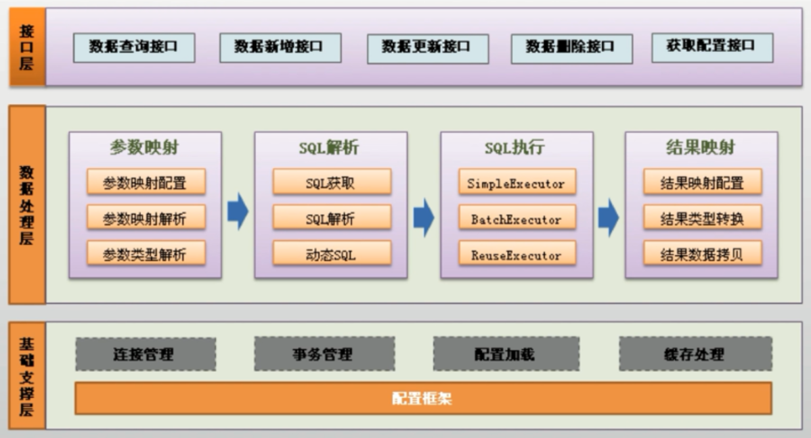

# MyBatis  

## 1.ORM

ORM也就是对象关系映射，它其实是创建了一个可在编程语言里使用的--“虚拟对象数据库”。

将关系数据库映射成对象，每行代表一个对象，而每一行中的每一列代表该对象的每个属性。   

_万物皆对象，数据库其实也可以把每行看作对象，而orm其实就是用java代码把数据库的对象实现出来_    

Mybatis跟其他orm框架不同的是，它不是直接建立java对象和数据库之间的映射关系，对对象的操作方法到sql语句的映射关系。由于编写sql，所以用户获得sql执行的更多控制，所以开发者可以编写更加高效的sql语句。  

_我们用java对象直接操作数据库，方便但是不灵活。而sql来写则不方便。mybatis用xml标记然后用java查找占位符，说白了就是给你在java和sql之间提供更灵活的映射方案_   

## 2.分层架构  

     

- 接口层：主要提供给开发人员，开发人员根据接口操作数据库    

- 数据处理层：收到接口层的命令后之后就会对数据进行处理（查找，执行，执行映射处理）   

- 基础支撑层：最基础功能的支撑（连接管理，事务管理，配置加载，缓存处理），为上层提供基础支撑。    

  _作为Mybatis我需要做三件事情：1.去跟用户要东西（接口层）2.将拿来的东西处理(数据处理层)3.维持系统的运行(基础支撑层)_   

## 3.环境搭建  

### 1. 加载jar包   

mybatis-3.2.3.jar
mysql-connector-java-5.1.28-bin.jar

_用使用mybatis，需要将mybatis加工厂搬到系统中。mybatis加工厂就像一个外包技术团队，专门处理sql方面的问题。_  

### 2.配置SqlSessionFactory     

1. 配置事务管理器   

依赖jdbc（也可以交给spring完成）

2. 数据源连接信息  
3. 添加mapper映射文件的位置   


```xml
<?xml version="1.0" encoding="UTF-8"?>
<!DOCTYPE configuration PUBLIC "-//mybatis.org//DTD Config 3.0//EN" "http://mybatis.org/dtd/mybatis-3-config.dtd">
<configuration>
    <environments default="development">
        <environment id="development">
            <transactionManager type="JDBC" />
            <!-- 配置数据库连接信息 -->
            <dataSource type="POOLED">
                <property name="driver" value="com.mysql.jdbc.Driver" />
                <property name="url" value="jdbc:mysql://localhost:3306/test" />
                <property name="username" value="root" />
                <property name="password" value="123456" />
            </dataSource>
        </environment>
    </environments>
    <mappers>
		<mapper resource="com/oumyye/mapping/userMapping.xml"/>
	</mappers>
</configuration>
```

_首先要做的是任务的交接，把原来需要给jdbc的数据写在配置文件中给了mybatis，由mybatis指派sql团队(mapper)做业务核心内容：sql语句_

### 3.新建Java对象，新建接口对对象进行操作    

编写属性，添加getter，setter方法   

### 4.mapper配置文件     

namespace指向接口类名，id是抽象方法，resultType指向对象，里面填写sql语句   

```xml
<?xml version="1.0" encoding="UTF-8" ?>
<!DOCTYPE mapper
PUBLIC "-//mybatis.org//DTD Mapper 3.0//EN"
"http://mybatis.org/dtd/mybatis-3-mapper.dtd">
<mapper namespace="cn.leekoko.getUser">
    <select id="getUserById" parameterType="Integer" resultType="cn.leekoko.User">
        select * from user where id=#{id}
    </select>
</mapper>
```


_sql团队负责sql语句的开发，它还需要知道方法的类名，方法的名称，传入传出的数据类型。其中比较高级的对象类型，则需要新建对象来实现。_   

### 5.编写抽象方法接口   

```java
package cn.leekoko;
public interface getUser {
	public User getUser(int id);
}
```

_接口部门比较轻松，只需写入接口的抽象方法即可。_

### 6.劣势   

1. 自己编写sql语句  
2. 数据库移植性比较差  

## 4.MyBatis的Java代码    

```java
	public static void main(String[] args) {
		//1.配置文件加载
		String resource="conf.xml";
		InputStream is=HelloBatis.class.getClassLoader().getResourceAsStream(resource);
		//2.创建SqlSessionFactory
		SqlSessionFactory sessionFactory=new SqlSessionFactoryBuilder().build(is);
		//3.获取Session
		SqlSession session=sessionFactory.openSession();
		try{
			//4.获取操作类
			getUser getUser=session.getMapper(getUser.class);
			//5.完成操作查询
			User user=getUser.getUserById(2);
			System.out.println("id="+user.getId()+",userName="+user.getUserName()+",password="+user.getPassword());
		}finally{
			//6.关闭Session
			session.close();
		}
	}
```

1.配置文件加载

2.创建SqlSessionFactory

3.获取Session

mybatis默认开启事务（非自动提交），关闭方式：``SqlSession session=sessionFactory.openSession(true);``

4.获取操作类

5.完成操作查询

_java代码负责的是组织工作，首先入驻配置团队（配置文件），配置团队经过自我适应调节之后，就会变成sessionFactory，其通过openSession组织一个session团队。session团队通过配合接口部门工作，就可以执行接口部门里面的方法，从而返回结果。_   

### 2.方式二案例：注解查询   

配置文件中不需要添加mapper   

```java
	@Select("select * from user where id=#{id}")
	public User getUserByZ(int id);	
```

_后来公司觉得接口部门人少事少，就把它和核心部门合并成一个接口核心部门_  


